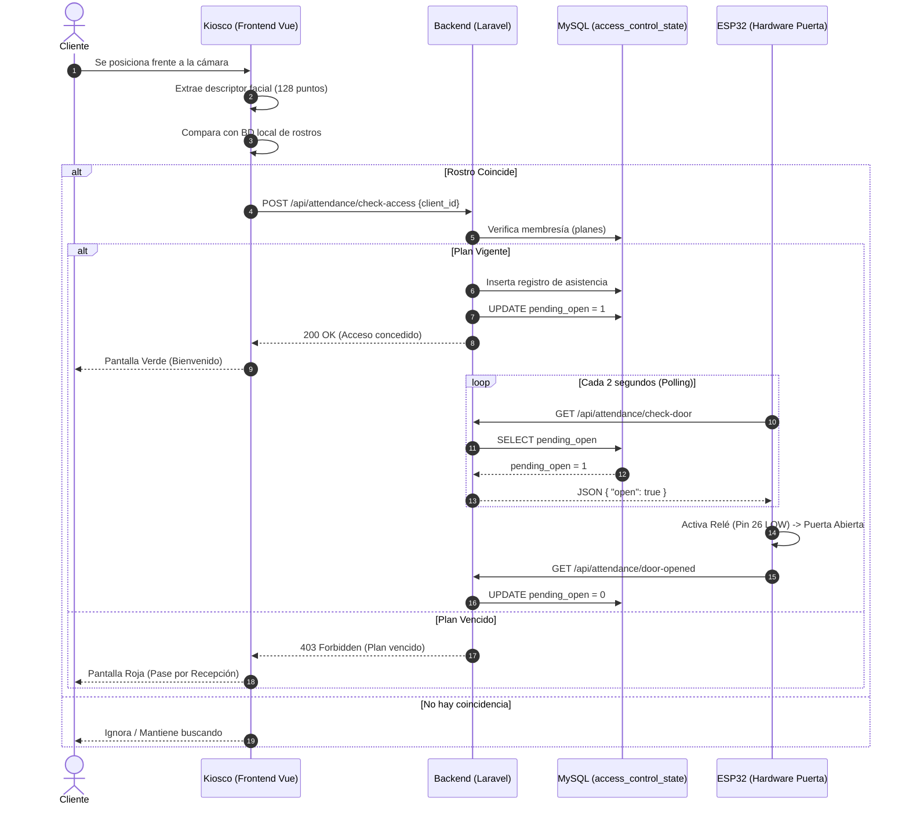
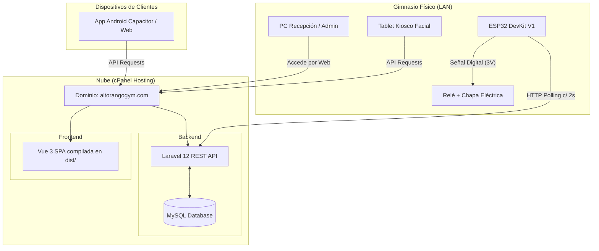

# Casos de Uso y Diagramas UML - Alto Rango SaaS

Este documento describe la arquitectura funcional del sistema del gimnasio Alto Rango, detallando los actores involucrados, los casos de uso principales y la interacción de los componentes mediante diagramas UML (formato Mermaid).

---

## 👥 1. Actores del Sistema

| Actor | Descripción |
| :--- | :--- |
| **Administrador** | Usuario con control total (root) del sistema. Puede ver finanzas, gestionar usuarios, planes, configuración de kiosco y sucursales. |
| **Recepcionista** | Usuario operativo. Vende membresías, registra nuevos clientes, productos, gestiona pagos manuales y asistencias. |
| **Entrenador** | Usuario enfocado en el área deportiva. Asigna rutinas, gestiona clases y visualiza datos físicos (IMC) de los clientes. |
| **Cliente** | Usuario final del gimnasio. Puede acceder a su perfil web para ver su membresía, historial de pagos y rutinas asignadas. |
| **Kiosco (Sistema)** | Dispositivo de hardware (Tablet/PC con cámara) que interactúa automáticamente con la IA para reconocimiento facial. |
| **ESP32 (Hardware)** | Microcontrolador conectado al relé de la puerta. Actúa recibiendo órdenes del sistema para aperturas físicas. |

---

## 🎯 2. Casos de Uso Principales

1. **CU01 - Gestión de Clientes:** Registrar, editar, eliminar y ver detalles biométricos/físicos de un cliente.
2. **CU02 - Control de Acceso Facial:** Validar la identidad de un cliente mediante la cámara, verificar su estado de plan y registrar asistencia.
3. **CU03 - Apertura Manual:** El Administrador abre la cerradura eléctrica de forma remota sin requerir validación facial.
4. **CU04 - Gestión de Inventario y Ventas:** Registrar productos y procesar ventas (POS) para clientes o público general.
5. **CU05 - Gestión de Planes y Pagos:** Asignar una membresía a un cliente, renovar planes y emitir el registro de pago.
6. **CU06 - Asignación de Rutinas:** El entrenador asigna una rutina de ejercicios personalizada a un cliente.

---

## 📊 3. Diagrama de Casos de Uso

A continuación se muestra el esquema general de qué puede hacer cada actor dentro de Alto Rango:

```mermaid
usecaseDiagram
    actor "Administrador" as admin
    actor "Recepcionista" as rec
    actor "Entrenador" as ent
    actor "Cliente" as cli
    actor "Kiosco Facial" as kiosco
    
    package "Alto Rango SaaS" {
        usecase "Gestionar Sucursales y Usuarios" as UC_Admin1
        usecase "Apertura Remota / Manual" as UC_Admin2
        
        usecase "Registrar Clientes" as UC_G1
        usecase "Gestionar Pagos y Planes" as UC_G2
        usecase "Vender Productos (POS)" as UC_G3
        
        usecase "Asignar Rutinas" as UC_E1
        usecase "Ver Ficha Física" as UC_E2
        
        usecase "Escanear Rostro" as UC_K1
        usecase "Verificar Membresía Activa" as UC_K2
        
        usecase "Ver Estado de Membresía" as UC_C1
        usecase "Ver Rutina Asignada" as UC_C2
    }
    
    admin --> UC_Admin1
    admin --> UC_Admin2
    admin --> UC_G1
    admin --> UC_G2
    admin --> UC_G3
    
    rec --> UC_G1
    rec --> UC_G2
    rec --> UC_G3
    
    ent --> UC_E1
    ent --> UC_E2
    
    kiosco --> UC_K1
    kiosco --> UC_K2
    
    cli --> UC_C1
    cli --> UC_C2
```

---

## 🔄 4. Diagrama de Secuencia: Control de Acceso y Apertura de Puerta

Este diagrama explica el flujo técnico que ocurre cuando un cliente se pone frente a la cámara, interactuando con el backend en Laravel y el ESP32 (mediante HTTP Polling).



---

## 🏗️ 5. Diagrama de Despliegue (Arquitectura Física)

Muestra cómo se distribuyen los componentes de hardware y software en producción.


